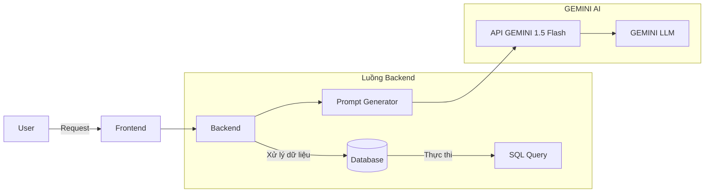

# Hướng dẫn Triển khai Website luyện tập và kiểm tra tiếng Anh

Website: [Hoccungminh](https://hoccungminh.onrender.com/)


## Mục lục
- [Giới thiệu](#giới-thiệu)
- [Kiến trúc hệ thống](#kiến-trúc-hệ-thống)
- [Yêu cầu hệ thống](#yêu-cầu-hệ-thống)
- [Cài đặt và Triển khai](#cài-đặt-và-triển-khai)
- [Tài liệu tham khảo](#tài-liệu-tham-khảo)

## Giới thiệu

Dự án này là một Website luyện tập và kiểm tra tiếng Anh sử dụng:
- Frontend: Tailwind CSS với HTML
- Backend: Django
- LLM: Gemini với mô hình 1.5 Flash
- Database: PostgreSQL

## Kiến trúc hệ thống



## Yêu cầu hệ thống

- Docker và Docker Compose
- Python 3.11+ (cho development)
- Git

## Cài đặt và Triển khai

### 1. Clone repository

```bash
git clone <repository-url>
cd <project-folder>
```
### 2. Build and run docker container

```bash
docker-compose build
docker compose up -d
```

### 3. Cấu trúc thư mục

```
.
├── docker-compose.yml
├── Dockerfile
├── Entrypoint.sh
├── requirements.txt
├── thq_core/
│   ├── .env
│   ├── settings.py
│   ├── urls.py
│   └── ...
├── thq_chat/
├── thq_exams/
├── thq_home/
├── thq_users/
├── templates/
└── static/

```

### 4. .env.sample

```env
ENVIRONMENT=
SECRET_KEY=
DATABASE_URL=

# VNPAY CONFIG
VNPAY_RETURN_URL=
VNPAY_PAYMENT_URL=
VNPAY_API_URL=
VNPAY_TMN_CODE=
VNPAY_HASH_SECRET_KEY=
# API GEMINI
API_KEY=
MODEL_NAME=
# MODEL_NAME=
# Email
EMAIL_HOST_USER=
EMAIL_HOST_PASSWORD=

# Superuser
DJANGO_SUPERUSER_USERNAME=
DJANGO_SUPERUSER_EMAIL=
DJANGO_SUPERUSER_PASSWORD=
```

### 5. entrypoint

```sh
#!/bin/sh

python manage.py makemigrations
python manage.py migrate

# Chạy lệnh tạo superuser
python manage.py createsuperuser --noinput

python manage.py runserver 0.0.0.0:8000 
```

### 6. Docker Compose

```yaml
name: hoc-cung-minh

services:
  app:
    build: 
      context: .
      dockerfile: Dockerfile
    image: my-app-image
    container_name: my-app-container
    env_file:
      - ./thq_core/.env
    command: /app/entrypoint.sh
    ports:
      - "8001:8000"
    volumes:
      - .:/app
    depends_on:
      - postgres

  postgres:
    image: postgres
    container_name: my-postgres-container
    ports:
      - "5432:5432"
    environment:
      POSTGRES_DB: postgres
      POSTGRES_USER: postgres
      POSTGRES_PASSWORD: postgres
    restart: unless-stopped
    volumes:
      - postgres_data:/var/lib/postgresql/data

volumes:
  postgres_data:
```

## Tài liệu tham khảo

- [Python Documentation](https://www.python.org/doc/)
- [Tailwind CSS Documentation](https://tailwindcss.com/docs/)
- [Gemini AI Documentation](https://ai.google.dev/)
- [PostgreSQL Documentation](https://www.postgresql.org/docs/)
